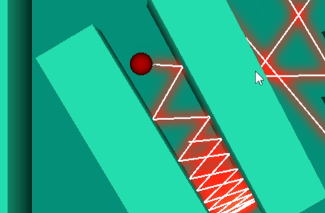
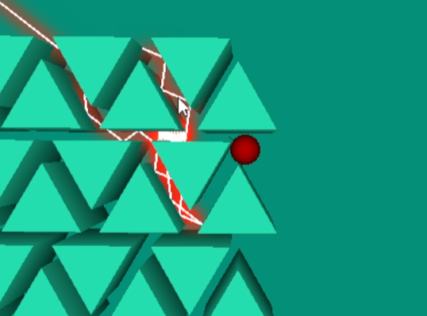
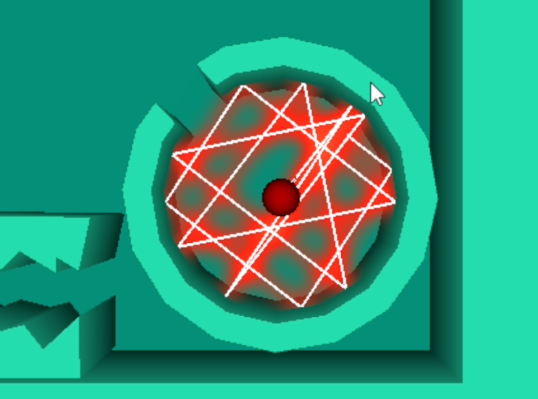

# C Laser Physics

[YouTube Video](https://youtu.be/Ckl28zhAK58)

From YouTube description:
The software rendering and "physics" in this video were written entirely from scratch in C by me, Harrison (aka FuzzyCat). SDL2 was used to open the window.

This project features:
- Array of polygons to represent walls
- Dynamic line segments that reflect off polygons to represent bouncing lasers
- Collision between circular player and polygons using variable timestep
- Collision between lasers and polygons using exact ray trace
- 2.5D parallax rendering using repeated line rasterization at varying scale + polygon rasterization for the tops
- Gaussian blur filter to make lasers "glow"
- Simple python script to convert Inkscape "plain SVG" format to C code for level design

This program runs at about 500 fps on my machine without the Gaussian blur, and sinks to about 60 fps with Gaussian blur on.
